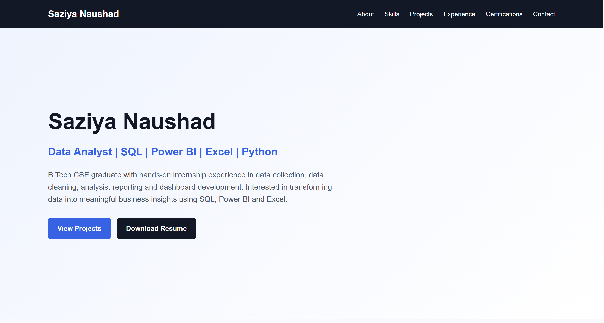

# Saziya Naushad – Data Analyst Portfolio

## 📌 Portfolio Overview

A personal Data Analyst portfolio showcasing my skills, projects, internship experience, certifications, and practical work in data analytics and business intelligence.

The portfolio highlights my experience with SQL, Power BI, Excel, Python, data visualization, data cleaning, and dashboard development.

## 🎯 Objective

The objective of this portfolio is to showcase my practical knowledge and hands-on experience in data analytics through real-world projects, internships, dashboards, and learning achievements.

It provides recruiters and hiring managers with an overview of my technical skills, project work, and professional experience.

## 🛠️ Tools and Technologies

- HTML
- CSS
- SQL
- Power BI
- Excel
- Python
- Pandas
- NumPy
- Tableau
- Power Query
- DAX
- GitHub
- GitHub Pages

## 📊 Portfolio Highlights

- Power BI dashboards and business analytics projects
- SQL data analysis and practical SQL queries
- Excel-based data analysis and reporting
- Data cleaning and transformation
- Interactive dashboard development
- Recruitment and sales analytics
- Internship experience in data analytics
- Data Analytics certifications and job simulations

## 💡 Key Highlights

- Built multiple Power BI and Excel dashboards using real-world datasets.
- Worked on data collection, cleaning, validation, analysis, and reporting during internships.
- Developed SQL queries for data manipulation and analysis.
- Created business-focused dashboards to identify trends, performance gaps, and key insights.
- Gained practical exposure to Power BI, SQL, Excel, Python, and data visualization.
- Documented projects and learning work through GitHub repositories.

## 🖼️ Portfolio Preview

The live portfolio includes:

- About Me
- Technical Skills
- Data Analytics Projects
- Internship Experience
- Certifications
- Contact Information

  

🌐 **Live Portfolio:**  
https://saziyanaushad.github.io/

## 📁 Portfolio Sections

- `Home` – Professional introduction and profile
- `About` – Educational background and career profile
- `Skills` – Technical and analytical skills
- `Projects` – Data analytics and dashboard projects
- `Internship Experience` – Practical industry experience
- `Certifications` – Courses, certifications, and job simulations
- `Contact` – Professional contact and profile links

## 📂 Featured Projects

- MRA Recruitment Dashboard – Power BI
- Mobile Sales Dashboard – Power BI
- Amazon Store Sales Dashboard – Power BI
- Sales Performance Dashboard – Excel
- SQL Data Analysis / SQL Practice Projects

Each project is maintained in a separate GitHub repository and linked through the portfolio.

## 💼 Internship Experience

### Alvionx – Data Analyst Intern
Worked on data collection, cleaning, analysis, reporting, and dashboard development using SQL, Excel, and Power BI.

### To Let Globe – Data Analyst Intern
Worked with Excel and Google Sheets for data collection, cleaning, validation, analysis, and reporting support.

### InAmigos Foundation – AI & Data Analytics Intern
Worked on NGO research, AI-based recommendations, data analysis, and social-impact research activities.

## 🎓 Education

**B.Tech – Computer Science & Engineering**  
R V Institute of Technology, Bijnor  
CGPA: **8.75**

## 📜 Certifications & Learning

- Deloitte Data Analytics Job Simulation – Forage
- Tata GenAI Powered Data Analytics Job Simulation
- Cisco Data Analytics Essentials
- 30-Day SQL / PostgreSQL Course
- Power BI Workshop – Office Master
- Master SQL with AI Skills – WSCube Tech

## 📌 Project Type

**Data Analytics | Business Intelligence | Dashboard Development | SQL | Data Visualization**

## 👩‍💻 Author

**Saziya Naushad**

Data Analyst | SQL | Power BI | Excel | Python

🌐 Portfolio: https://saziyanaushad.github.io/
